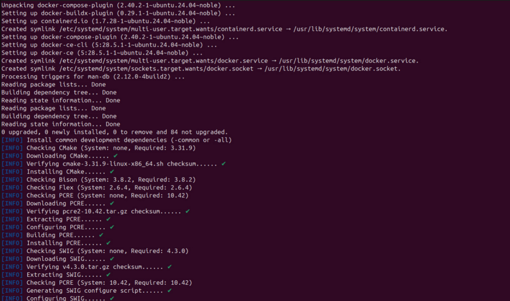
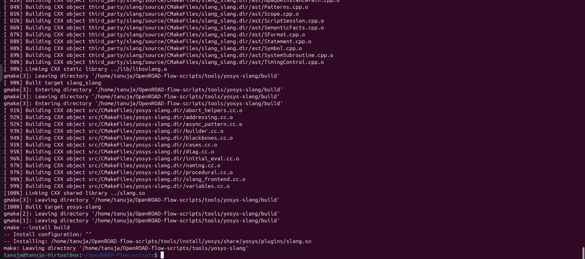
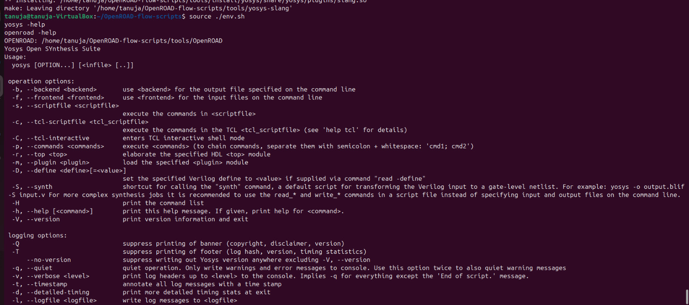
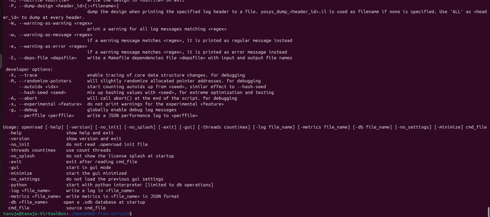
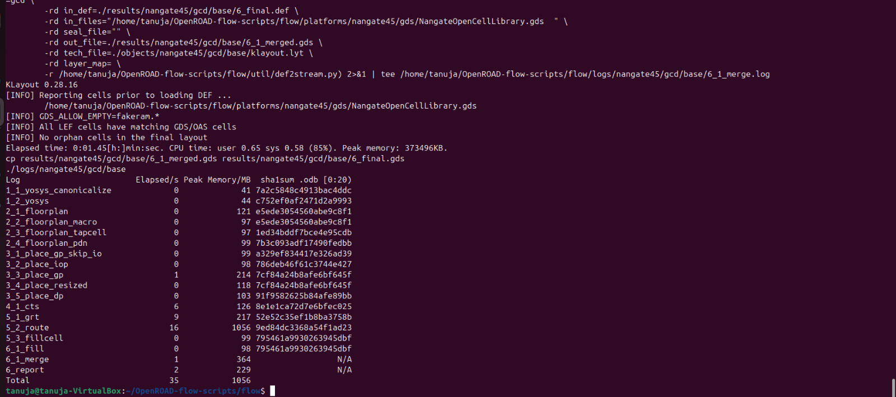
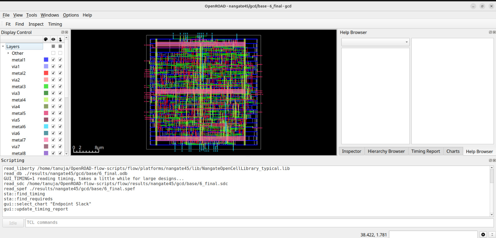
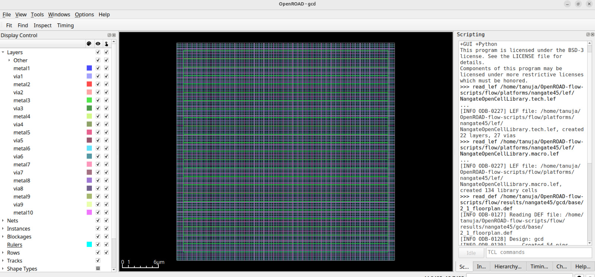
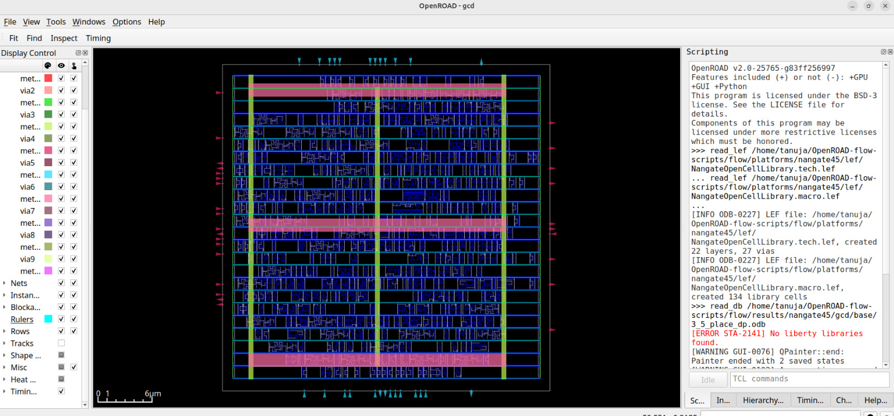

# RISC-V_SOC_Week_5
Installation of OpenROAD and introduction to floorplanning

# Week 5 – OpenROAD Flow Setup and Floorplan + Placement

## Objective
The objective of this task is to set up the OpenROAD Flow Scripts environment and execute the **Floorplan** and **Placement** stages of the physical design flow. This task bridges the gap between transistor-level design (Week 4) and backend physical implementation.

## Importance
- Understand how logical designs are physically realized on silicon.
- Learn to apply design constraints before routing.
- Understand how standard cells are arranged to minimize delay, area, and congestion.
- Observe how physical design choices affect timing and manufacturability.
  
## Steps to Install OpenROAD and Run GUI

1. Clone the OpenROAD Repository

```bash

git clone --recursive https://github.com/The-OpenROAD-Project/OpenROAD-flow-scripts
cd OpenROAD-flow-scripts

```

2. Run the Setup Script

```bash
sudo ./setup.sh
```


3. Build OpenROAD
   
```bash
./build_openroad.sh --local
```



4. Verify Installation

```bash
source ./env.sh
yosys -help  
openroad -help
```



5. Run the OpenROAD Flow
   
```bash
cd flow
make
```


6. Launch the graphical user interface (GUI) to visualize the final layout

```bash
 make gui_final
```



---

# Floorplanning and Placement in OpenROAD
Tried Floorplanning and placement for Gcd file in ~/OpenROAD-flow-scripts/flow

```bash
make DESIGN=gcd FLOW_STEPS=floorplan,placement
cd ~/OpenROAD-flow-scripts/flow/results/nangate45/gcd/base
openroad
```
```openroad
openroad> read_db 2_1_floorplan.odb
write_def 2_1_floorplan.def
exit
openroad> read_db 3_5_place_dp.odb
write_def 3_5_place_dp.def
exit
```
```bash
openroad -gui
```

## Floorplan logs
```
OpenROAD v2.0-25765-g83ff256997 
Features included (+) or not (-): +GPU +GUI +Python
This program is licensed under the BSD-3 license. See the LICENSE file for details.
Components of this program may be licensed under more restrictive licenses which must be honored.
>>> read_lef /home/tanuja/OpenROAD-flow-scripts/flow/platforms/nangate45/lef/NangateOpenCellLibrary.tech.lef
... 
[INFO ODB-0227] LEF file: /home/tanuja/OpenROAD-flow-scripts/flow/platforms/nangate45/lef/NangateOpenCellLibrary.tech.lef, created 22 layers, 27 vias
>>> read_lef /home/tanuja/OpenROAD-flow-scripts/flow/platforms/nangate45/lef/NangateOpenCellLibrary.macro.lef
... 
[INFO ODB-0227] LEF file: /home/tanuja/OpenROAD-flow-scripts/flow/platforms/nangate45/lef/NangateOpenCellLibrary.macro.lef, created 134 library cells
>>> read_def /home/tanuja/OpenROAD-flow-scripts/flow/results/nangate45/gcd/base/2_1_floorplan.def
[INFO ODB-0127] Reading DEF file: /home/tanuja/OpenROAD-flow-scripts/flow/results/nangate45/gcd/base/2_1_floorplan.def
[INFO ODB-0128] Design: gcd
[INFO ODB-0130]     Created 54 pins.
[INFO ODB-0131]     Created 503 components and 2570 component-terminals.
[INFO ODB-0133]     Created 574 nets and 1564 connections.
[INFO ODB-0134] Finished DEF file: /home/tanuja/OpenROAD-flow-scripts/flow/results/nangate45/gcd/base/2_1_floorplan.def
>>> read_db /home/tanuja/OpenROAD-flow-scripts/flow/results/nangate45/gcd/base/2_1_floorplan.odb
[ERROR ORD-0047] You can't load a new db file as the db is already populated
[ERROR GUI-0070] ORD-0047
ORD-0047
    while executing
"ord::read_db_cmd $filename $hierarchy"
    (procedure "read_db" line 12)
    invoked from within
"read_db /home/tanuja/OpenROAD-flow-scripts/flow/results/nangate45/gcd/base/2_1_floorplan.odb"
>>> read_def /home/tanuja/OpenROAD-flow-scripts/flow/results/nangate45/gcd/base/3_5_place_dp.def
[INFO ORD-0048] Loading an additional DEF.
```

## Placement logs
```
OpenROAD v2.0-25765-g83ff256997 
Features included (+) or not (-): +GPU +GUI +Python
This program is licensed under the BSD-3 license. See the LICENSE file for details.
Components of this program may be licensed under more restrictive licenses which must be honored.
>>> read_lef /home/tanuja/OpenROAD-flow-scripts/flow/platforms/nangate45/lef/NangateOpenCellLibrary.tech.lef
... read_lef /home/tanuja/OpenROAD-flow-scripts/flow/platforms/nangate45/lef/NangateOpenCellLibrary.macro.lef
... 
[INFO ODB-0227] LEF file: /home/tanuja/OpenROAD-flow-scripts/flow/platforms/nangate45/lef/NangateOpenCellLibrary.tech.lef, created 22 layers, 27 vias
[INFO ODB-0227] LEF file: /home/tanuja/OpenROAD-flow-scripts/flow/platforms/nangate45/lef/NangateOpenCellLibrary.macro.lef, created 134 library cells
>>> read_db /home/tanuja/OpenROAD-flow-scripts/flow/results/nangate45/gcd/base/3_5_place_dp.odb
```

