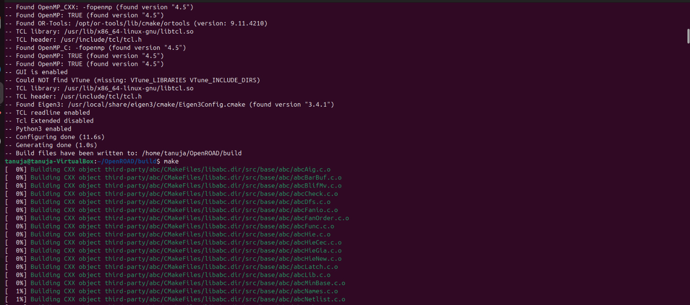

# RISC-V_SOC_Week_5
Installation of OpenROAD and introduction to floorplanning

# Week 5 – OpenROAD Flow Setup and Floorplan + Placement

## Objective
The objective of this task is to set up the OpenROAD Flow Scripts environment and execute the **Floorplan** and **Placement** stages of the physical design flow. This task bridges the gap between transistor-level design (Week 4) and backend physical implementation.

## Importance
- Understand how logical designs are physically realized on silicon.
- Learn to apply design constraints before routing.
- Understand how standard cells are arranged to minimize delay, area, and congestion.
- Observe how physical design choices affect timing and manufacturability.
## Steps to Install OpenROAD and Run GUI
1. Clone the OpenROAD Repository
bash```
git clone --recursive https://github.com/The-OpenROAD-Project/OpenROAD-flow-scripts
cd OpenROAD-flow-scripts
```

2. Run the Setup Script
bash```
sudo ./setup.sh
```


3. Build OpenROAD
bash```
./build_openroad.sh --local
```



4. Verify Installation
bash```
source ./env.sh
yosys -help  
openroad -help
```


5. Run the OpenROAD Flow
bash```
cd flow
make
```


6. Launch the graphical user interface (GUI) to visualize the final layout
bash```
 make gui_final
```

